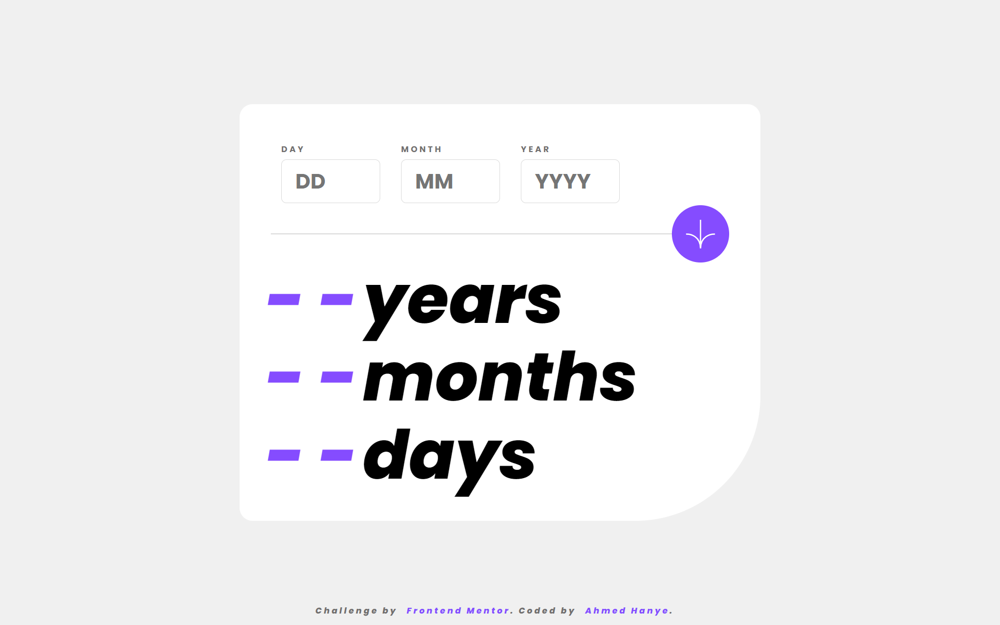

# Age Calculator App

Link to the website: https://ahmedhanye.github.io/age-calculator-app-main/

## Description

This is a simple Age Calculator app built using HTML, CSS, and JavaScript. It allows users to input their birthdate, and it calculates and displays the age in years, months, and days.

## Features

- Input fields for day, month, and year.
- Age calculation and display.
- Responsive design.

## Usage

1. Enter your birthdate in the input fields.
2. Click the button to calculate your age.
3. View the calculated age in years, months, and days.

